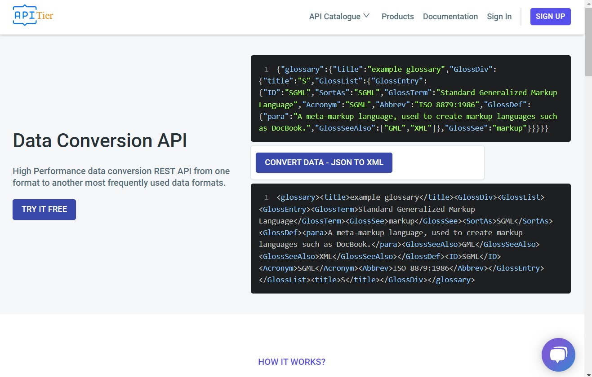

# Data Conversion API Demo | APITier

## JSON TO XML Screenshot 

* JSON to XML helps convert JSON data to XML. It's very simple and easy way to transform and share JSON to XML data.
* Just paste the code or upload a JSON file you desire to convert and click on the “CONVERT DATA - JSON TO XML” button for results.
* There is no need to learn special skills to use this online converter. You need to upload the JSON files on this input field and click the convert button to initiate the process. The API will process your input and provide you with the output within a matter of seconds. 
* JSON to XML Online works well on Windows, MAC, Linux, Chrome, Firefox, Edge, and Safari. <br /><br />

  

### How to Use Our JSON to XML Conversion

* After accessing this JSON to XML Conversion, Enter or paste the code in the input field.
* You can also upload the JSON file in the field given for the conversion.
* For the processing to take place, click the button “CONVERT DATA - JSON TO XML”. The API will provide you the converted XML code instantly.
* You can copy and paste the code into your original file. 

### Example
The below example illustrate the data of the glossary.

* **Input Field - JSON DATA**


```json title="Example"
{
    "glossary": {
        "title": "example glossary",
		"GlossDiv": {
            "title": "S",
			"GlossList": {
                "GlossEntry": {
                    "ID": "SGML",
					"SortAs": "SGML",
					"GlossTerm": "Standard Generalized Markup Language",
					"Acronym": "SGML",
					"Abbrev": "ISO 8879:1986",
					"GlossDef": {
                        "para": "A meta-markup language, used to create markup languages such as DocBook.",
						"GlossSeeAlso": ["GML", "XML"]
                    },
					"GlossSee": "markup"
                }
            }
        }
    }
}

```
<br />

* **Output Field - XML DATA**


```xml title="Example "
<glossary>
    <title>example glossary</title>
    <GlossDiv>
        <GlossList>
            <GlossEntry>
                <GlossTerm>Standard Generalized Markup Language</GlossTerm>
                <GlossSee>markup</GlossSee>
                <SortAs>SGML</SortAs>
                <GlossDef>
                    <para>A meta-markup language, used to create markup languages such as DocBook.</para>
                    <GlossSeeAlso>GML</GlossSeeAlso>
                    <GlossSeeAlso>XML</GlossSeeAlso>
                </GlossDef>
                <ID>SGML</ID>
                <Acronym>SGML</Acronym>
                <Abbrev>ISO 8879:1986</Abbrev>
            </GlossEntry>
        </GlossList>
        <title>S</title>
    </GlossDiv>
</glossary>
```